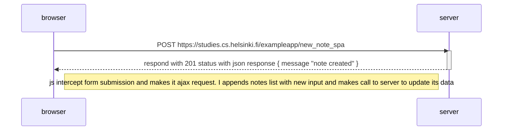

```mermaid
sequenceDiagram
  participant browser
  participant server

  browser->>server: POST 	https://studies.cs.helsinki.fi/exampleapp/new_note_spa
  activate server
  server-->>browser: respond with 201 status with json response { message	"note created" }
  deactivate server

 
  Note right of browser: js intercept form submission and makes it ajax request. I appends notes list with new input and makes call to server to update its data
```